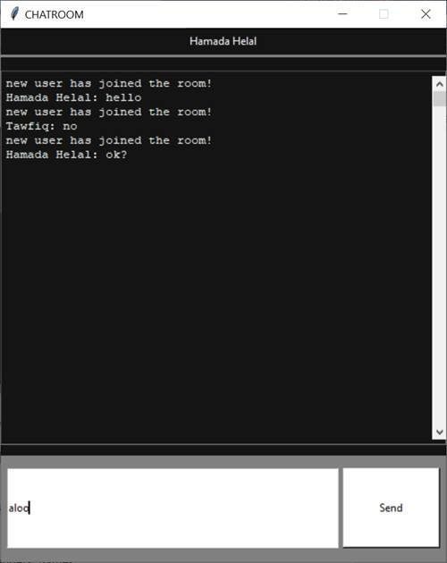

# chat_program
A simple local network chatting program made using [Tkinter](https://wiki.python.org/moin/TkInter) for the interface  
with socket and threading to maintain the networking

## Requirments
- Python 3.x (recommended) from [here](http://www.pygame.org/download.shtml)
- Tkinter  

_Tkinter can be installed using pip_  
run in the command propmt
```
pip install tk
```
_This command will start downloading and installing packages related to the Tkinter library. Once done, the message of successful installation will be displayed._

## Usage
run the server code first
```
python server_final.py
```
_the message of server is listening on (ip) will be displayed._ 

run the client code to join the chatroom
```
python client_final.py
```
_login window will be displayed, type in your name then press login_ 


##Screenshot  


